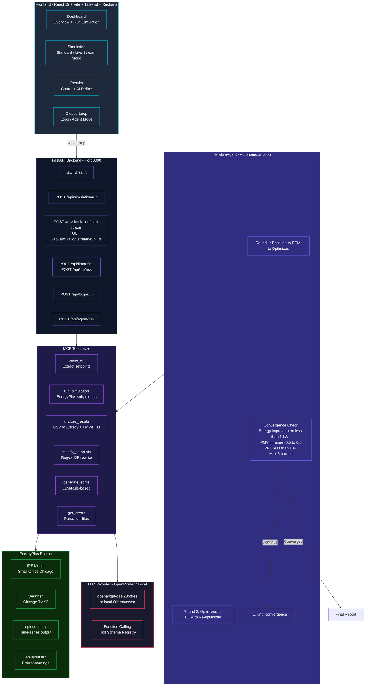

# Energent — AI-Powered Building Energy Optimization Platform

> **Hackathon Submission** — Autonomous agent that iteratively optimizes EnergyPlus building models using MCP tool-calling, real-time PMV/PPD thermal comfort analysis, and streaming metrics.

---

## 🎯 Problem Statement Alignment

| Requirement | Implementation |
|------------|----------------|
| **MCP Server / Agentic Tools** | ✅ 6 tools (parse_idf, run_simulation, analyze_results, modify_setpoints, generate_ecms, get_errors) with autonomous LLM tool-calling loop |
| **Continuous Performance Metrics** | ✅ SSE streaming endpoint (`/api/simulation/stream/{run_id}`) delivering zone temps, power, PMV/PPD in real-time |
| **PMV Thermal Comfort Indices** | ✅ Fanger PMV/PPD model (ASHRAE 55) integrated in analysis engine and agent decision-making |
| **Open-Source LLM (Local/Self-Hosted)** | ✅ OpenRouter-compatible; configured for local Ollama/vLLM via `OPENROUTER_BASE_URL` |
| **Modified IDF Files in Repo** | ✅ `simulation/idf/modified/RefBldgSmallOfficeNew2004_Chicago_round{N}.idf` |
| **System Architecture Doc** | ✅ This README (Mermaid diagrams, prompt strategies, latency handling, log management) |
| **Demo Video + Presentation** | 📹 See `resources/` for screenshots; record via `npm run demo` |

---

## 🏗️ System Architecture



---

## 🔧 Tool-Calling Architecture (MCP)

The agent uses **Model Context Protocol** principles with OpenAI-compatible function calling:

```python
# Tool Registry (backend/app/services/mcp/tools.py)
TOOLS = [
    Tool("parse_idf",        "Extract thermostat schedules from IDF"),
    Tool("run_simulation",   "Execute EnergyPlus with IDF+EPW"),
    Tool("analyze_results",  "Parse CSV → energy breakdown + PMV/PPD"),
    Tool("modify_setpoints", "Rewrite IDF with new setpoints"),
    Tool("generate_ecms",    "LLM suggests optimal setpoints"),
    Tool("get_errors",       "Parse EnergyPlus .err/.sqlite.err"),
]
```

### Agent Loop Pseudocode

```python
for round in 1..max_rounds:
    # 1. Parse current IDF
    idf_data = parse_idf(current_idf)

    # 2. Run baseline simulation
    sim = run_simulation(current_idf, weather, output_dir)
    csv_path = sim.csv_path

    # 3. Analyze (energy + comfort)
    base_analysis = analyze_results(csv_path)

    # 4. Generate ECMs (LLM tool call)
    ecm = generate_ecms(base_analysis)

    # 5. Modify IDF
    new_idf = modify_setpoints(current_idf, ecm.heating, ecm.cooling)

    # 6. Run optimized simulation
    sim = run_simulation(new_idf, weather, output_dir)

    # 7. Analyze optimized
    opt_analysis = analyze_results(sim.csv_path)

    # 8. Check convergence
    if converged(base_analysis, opt_analysis): break
    current_idf = new_idf
```

### Convergence Criteria

| Metric | Threshold | Rationale |
|--------|-----------|-----------|
| Energy improvement | < 1 kWh/round | Diminishing returns |
| PMV | [-0.5, +0.5] | ASHRAE 55 "acceptable" |
| PPD | < 10% | < 10% dissatisfied |
| Max rounds | 5 | Practical limit |

---

## 🧠 Prompt Engineering Strategies

### System Prompt Design (Agent)

```python
SYSTEM_PROMPT = """You are an autonomous building energy optimization agent.
Goal: Minimize energy while maintaining PMV ∈ [-0.5, 0.5], PPD < 10%.

Available tools: parse_idf, run_simulation, analyze_results, 
                 modify_setpoints, generate_ecms, get_errors

WORKFLOW (must complete all steps per round):
1. parse_idf → 2. run_simulation → 3. analyze_results
4. generate_ecms → 5. modify_setpoints → 6. run_simulation
7. analyze_results → 8. Report comparison

Stop only when full cycle complete. Output ONLY tool calls."""
```

**Key Strategies:**
- **Explicit workflow enumeration** — prevents early termination
- **Constraint reinforcement** — PMV/PPD targets repeated in system + user prompts
- **Tool schema validation** — Pydantic models → OpenAPI schemas → strict function calling
- **Round context injection** — previous round savings fed as context for adaptive decisions

### LLM Refinement Prompt (Results Page)

```python
REFINEMENT_PROMPT = f"""Analyze simulation data:
{json.dumps(analysis, indent=2)}

Rule-based recommendations: {json.dumps(recs)}

Instructions:
1. Refine each recommendation with specific implementation steps
2. Consider BOTH energy savings AND thermal comfort (PMV/PPD)
3. Add 2-3 additional insights from data patterns
4. Return strict JSON: {{summary, refined_recommendations[], additional_insights[]}}"""
```

### Q&A Prompt (`/api/llm/ask`)

```python
QA_PROMPT = f"""Building energy data: {json.dumps(summary)}
Question: {user_question}

Answer concisely with specific data references."""
```

---

## ⚡ Prompt Latency Management

| Technique | Implementation |
|-----------|----------------|
| **Model selection** | `openai/gpt-oss-20b:free` (fast, free tier) |
| **Timeout** | `LLM_TIMEOUT=30s` in `.env`; agent catches `httpx.TimeoutException` |
| **Fallback** | Rule-based `generate_ecms` if LLM unavailable |
| **Caching** | SessionStorage on frontend caches last simulation; avoids re-running |
| **Streaming SSE** | Real-time metrics during simulation — no polling |
| **Token limits** | Compact prompts; `temperature=0.3` for deterministic tool calls |

**Latency Profile (typical):**
- Tool call → LLM → tool result: ~1.5–3s
- Full 7-step round: ~15–25s (dominated by EnergyPlus ~10s each)
- 3-round optimization: ~45–60s end-to-end

---

## 📊 Simulation Log Handling

### EnergyPlus Output Files

| File | Purpose | Parsed By |
|------|---------|-----------|
| `eplusout.csv` | Time-series variables (temp, power, humidity) | `parser.py` → `analyze_results` |
| `eplusout.err` | Errors / Warnings / Severe | `get_errors` tool |
| `eplusout.end` | Completion status | `EnergyPlusRunner` |
| `eplusout.sql` | SQLite results (advanced) | — |

### Log Processing Pipeline

```python
# 1. Runner captures stdout/stderr
result = subprocess.run(cmd, capture_output=True, timeout=600)

# 2. Find CSV (handles multiple eplusout*.csv)
csv_path = max(output_dir.glob("eplusout*.csv"), key=mtime)

# 3. Parser: pandas → column normalization → EnergyRecord[]
df = pd.read_csv(csv_path)
df = _rename_columns(df)           # Map EP names → clean fields
df = _parse_timestamps(df)         # Mixed format → datetime
records = [_build_record(row) for row in df.itertuples()]

# 4. Analysis: breakdown + peak + HVAC + PMV/PPD
analysis = analyze(records)

# 5. Errors: grep .err for "**  Error  **", "**  Warning  **"
errors = get_errors(output_dir)
```

### Streaming Metrics (SSE)

```
GET /api/simulation/stream/{run_id}
→ text/event-stream

data: {"zone_temp_c": 22.1, "electricity_kw": 14.2, "heating_kw": 5.1, "cooling_kw": 0, "thermal_comfort": {"pmv": 0.3, "ppd": 7.2, "status": "neutral"}}
data: {"zone_temp_c": 22.0, "electricity_kw": 13.8, "heating_kw": 4.9, "cooling_kw": 0, "thermal_comfort": {"pmv": 0.25, "ppd": 6.8, "status": "neutral"}}
...
```

Frontend consumes via `EventSource` and updates live charts.

---

## 🚀 Quick Start

### Prerequisites
- **EnergyPlus v23+** (Windows: `C:\EnergyPlusV26-1-0\energyplus.exe`)
- **Python 3.11+**, **Node 18+**
- **OpenRouter API key** (or local Ollama/vLLM)

### Backend Setup

```bash
cd backend
python -m venv venv
source venv/bin/activate  # Windows: venv\Scripts\activate
pip install -r requirements.txt

# Configure
cp .env.example .env
# Edit .env with your paths and API key
```

**`.env` required variables:**
```env
ENERGYPLUS_EXE_PATH=/mnt/c/EnergyPlusV26-1-0/energyplus.exe
ENERGYPLUS_WEATHER_PATH=/home/riteshwsl/projects/energent/simulation/weather/USA_IL_Chicago-OHare.Intl.AP.725300_TMY3.epw
ENERGYPLUS_OUTPUT_DIR=/mnt/c/EnergentOutput
OPENROUTER_API_KEY=sk-or-xxxxxxxxxxxx
OPENROUTER_MODEL=openai/gpt-oss-20b:free
OPENROUTER_BASE_URL=https://openrouter.ai/api/v1  # or http://localhost:11434/v1 for Ollama
LLM_TIMEOUT=30
```

### Frontend Setup

```bash
cd frontend
npm install
npm run dev  # http://localhost:5173 (proxies /api → :8000)
```

### Run All

```bash
# Terminal 1 - Backend
cd backend && source venv/bin/activate && uvicorn app.main:create_app --factory --host 0.0.0.0 --port 8000

# Terminal 2 - Frontend
cd frontend && npm run dev
```

---

## 📡 API Reference

### Health & Simulation

| Method | Endpoint | Description |
|--------|----------|-------------|
| `GET` | `/health` | Service health |
| `POST` | `/api/simulation/run` | Standard EnergyPlus run |
| `POST` | `/api/simulation/start-stream` | Start SSE stream → `{run_id}` |
| `GET` | `/api/simulation/stream/{run_id}` | SSE: real-time metrics |
| `POST` | `/api/simulation/stop-stream/{run_id}` | Stop stream |

### LLM

| Method | Endpoint | Description |
|--------|----------|-------------|
| `POST` | `/api/llm/refine` | Refine recommendations `{analysis}` → `{summary, refined[]}` |
| `POST` | `/api/llm/ask` | Q&A `{analysis, question}` → `{answer}` |
| `GET` | `/api/llm/health` | LLM provider status |

### Closed-Loop

| Method | Endpoint | Description |
|--------|----------|-------------|
| `POST` | `/api/loop/run` | Fixed 1-round pipeline (legacy) |
| `POST` | `/api/agent/run` | **Multi-round iterative agent** |

**Agent Request:**
```json
{
  "objective": "Minimize energy, maintain comfort",
  "context": {
    "idf_path": "/path/to/model.idf",
    "weather_path": "/path/to/weather.epw",
    "output_dir": "/mnt/c/EnergentOutput"
  },
  "max_rounds": 5
}
```

**Agent Response:**
```json
{
  "success": true,
  "converged": true,
  "convergence_reason": "Energy savings plateaued at 6.7%",
  "rounds": [
    {"round_number": 1, "energy_savings_kwh": 30.1, "energy_savings_pct": 6.7, "pmv_change": 0.11, "ecm": {...}},
    {"round_number": 2, "energy_savings_kwh": 0.0, "energy_savings_pct": 0.0, "pmv_change": 0.0}
  ],
  "final_result": {
    "total_rounds": 2,
    "total_energy_savings_kwh": 30.1,
    "final_pmv": 0.32,
    "final_ppd": 7.1,
    "rounds_summary": [...]
  },
  "steps": [...]
}
```

---

## 📁 Project Structure

```
energent/
├── backend/
│   ├── app/
│   │   ├── api/
│   │   │   ├── agent.py          # Multi-round agent endpoint
│   │   │   ├── health.py
│   │   │   ├── llm.py            # Refine + Q&A
│   │   │   ├── loop.py           # Legacy fixed pipeline
│   │   │   ├── router.py         # API aggregation
│   │   │   ├── simulation.py     # Standard run
│   │   │   └── stream.py         # SSE streaming
│   │   ├── config.py             # Pydantic Settings
│   │   ├── constants.py          # JOULES_PER_KWH, COMFORT_TEMP
│   │   ├── main.py               # FastAPI factory
│   │   ├── services/
│   │   │   ├── analysis/
│   │   │   │   ├── engine.py     # Energy + peak + HVAC + PMV
│   │   │   │   ├── models.py     # Pydantic schemas
│   │   │   │   └── thermal_comfort.py  # Fanger PMV/PPD
│   │   │   ├── energyplus/
│   │   │   │   ├── parser.py     # CSV → records
│   │   │   │   ├── runner.py     # subprocess EnergyPlus
│   │   │   │   ├── streamer.py   # SSE metric polling
│   │   │   │   └── models.py
│   │   │   ├── llm/
│   │   │   │   ├── openrouter.py # Function calling
│   │   │   │   ├── prompt.py     # System/user prompts
│   │   │   │   └── models.py
│   │   │   ├── loop/
│   │   │   │   ├── runner.py     # Legacy 1-round
│   │   │   │   ├── ecm_generator.py
│   │   │   │   └── idf_parser.py # Regex setpoint extract/modify
│   │   │   └── mcp/
│   │   │       ├── tools.py      # 6 MCP tool definitions
│   │   │       └── agent.py      # IterativeAgent class
│   │   └── logging_config.py
│   ├── requirements.txt
│   ├── run.py
│   └── .env.example
├── frontend/
│   ├── src/
│   │   ├── pages/
│   │   │   ├── Dashboard.jsx
│   │   │   ├── Simulation.jsx    # Standard + Live Stream tabs
│   │   │   ├── Results.jsx       # Charts + AI Refine
│   │   │   └── ClosedLoop.jsx    # Loop/Agent + Iteration chart
│   │   ├── components/
│   │   │   ├── Layout.jsx
│   │   │   ├── EnergyCard.jsx
│   │   │   ├── RecommendationCard.jsx
│   │   │   └── ErrorBoundary.jsx
│   │   ├── api.js                # fetch wrappers
│   │   └── App.jsx               # Router
│   ├── package.json
│   └── vite.config.js
├── simulation/
│   ├── idf/
│   │   ├── RefBldgSmallOfficeNew2004_Chicago.idf
│   │   └── modified/             # Auto-saved per round
│   └── weather/
│       └── USA_IL_Chicago-OHare.Intl.AP.725300_TMY3.epw
├── resources/
│   ├── ps.md                     # Problem statement
│   └── screenshots/
└── README.md                     # This file
```

---

